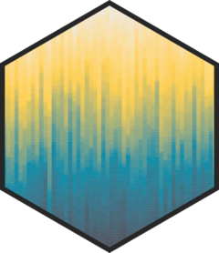
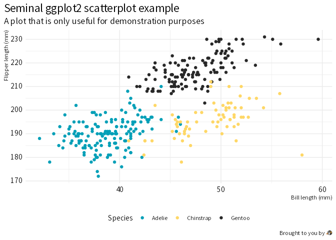

<!-- README.md is generated from README.Rmd. Please edit that file -->

# wjake <a href="https://wjake.wjakethompson.com"></a>

<!-- badges: start -->

[](https://www.repostatus.org/#active)
[](https://lifecycle.r-lib.org/articles/stages.html)
[](https://CRAN.R-project.org/package=wjake)
[](https://cran.r-project.org/package=wjake)</br>
[](https://github.com/wjakethompson/wjake/actions/workflows/R-CMD-check.yaml)
[](https://app.codecov.io/gh/wjakethompson/wjake)
[](https://github.com/wjakethompson/wjake/actions/workflows/pages/pages-build-deployment)</br>
[](https://keybase.io/wjakethompson)

<!-- badges: end -->

This is a personal R package containing utility functions and custom
themes for [ggplot2](https://ggplot2.tidyverse.org/) and
[gt](https://gt.rstudio.com/).

## Installation

You can install the released version of wjake from
[CRAN](https://cran.r-project.org/) with:

``` r
install.packages("wjake")
```

To install the development version from [GitHub](https://github.com/)
use:

``` r
# install.packages("remotes")
remotes::install_github("wjakethompson/wjake")
```

## Examples

Create branded plots with `theme_wjake()`:

``` r
library(ggplot2)

ggplot(penguins, aes(x = bill_len, y = flipper_len)) +
  geom_point(aes(color = species), na.rm = TRUE) +
  labs(
    x = "Bill length (mm)",
    y = "Flipper length (mm)",
    title = "Seminal ggplot2 scatterplot example",
    subtitle = "A plot that is only useful for demonstration purposes",
    caption = "Brought to you by \U1F427",
    color = "Species"
  ) +
  theme_wjake()
```



And tables with `gt_theme_wjake()`:

``` r
library(gt)

head(penguins) |>
  gt() |>
  gt_theme_wjake(bg_color = "white") |>
  fmt_number(year, decimals = 0, use_seps = FALSE)
```

<div id="obazwdgjnc" style="padding-left:0px;padding-right:0px;padding-top:10px;padding-bottom:10px;overflow-x:auto;overflow-y:auto;width:auto;height:auto;">
<style>#obazwdgjnc table {
  font-family: 'Source Sans Pro', system-ui, 'Segoe UI', Roboto, Helvetica, Arial, sans-serif, 'Apple Color Emoji', 'Segoe UI Emoji', 'Segoe UI Symbol', 'Noto Color Emoji';
  -webkit-font-smoothing: antialiased;
  -moz-osx-font-smoothing: grayscale;
}
&#10;#obazwdgjnc thead, #obazwdgjnc tbody, #obazwdgjnc tfoot, #obazwdgjnc tr, #obazwdgjnc td, #obazwdgjnc th {
  border-style: none;
}
&#10;#obazwdgjnc p {
  margin: 0;
  padding: 0;
}
&#10;#obazwdgjnc .gt_table {
  display: table;
  border-collapse: collapse;
  line-height: normal;
  margin-left: 0;
  margin-right: auto;
  color: #333333;
  font-size: 16px;
  font-weight: normal;
  font-style: normal;
  background-color: #FFFFFF;
  width: auto;
  border-top-style: solid;
  border-top-width: 1px;
  border-top-color: #A8A8A8;
  border-right-style: none;
  border-right-width: 2px;
  border-right-color: #D3D3D3;
  border-bottom-style: solid;
  border-bottom-width: 1px;
  border-bottom-color: #A8A8A8;
  border-left-style: none;
  border-left-width: 2px;
  border-left-color: #D3D3D3;
}
&#10;#obazwdgjnc .gt_caption {
  padding-top: 4px;
  padding-bottom: 4px;
}
&#10;#obazwdgjnc .gt_title {
  color: #333333;
  font-size: 125%;
  font-weight: initial;
  padding-top: 4px;
  padding-bottom: 4px;
  padding-left: 5px;
  padding-right: 5px;
  border-bottom-color: #FFFFFF;
  border-bottom-width: 0;
}
&#10;#obazwdgjnc .gt_subtitle {
  color: #333333;
  font-size: 85%;
  font-weight: initial;
  padding-top: 3px;
  padding-bottom: 5px;
  padding-left: 5px;
  padding-right: 5px;
  border-top-color: #FFFFFF;
  border-top-width: 0;
}
&#10;#obazwdgjnc .gt_heading {
  background-color: #FFFFFF;
  text-align: left;
  border-bottom-color: #FFFFFF;
  border-left-style: none;
  border-left-width: 1px;
  border-left-color: #D3D3D3;
  border-right-style: none;
  border-right-width: 1px;
  border-right-color: #D3D3D3;
}
&#10;#obazwdgjnc .gt_bottom_border {
  border-bottom-style: none;
  border-bottom-width: 2px;
  border-bottom-color: #D3D3D3;
}
&#10;#obazwdgjnc .gt_col_headings {
  border-top-style: none;
  border-top-width: 1px;
  border-top-color: #000000;
  border-bottom-style: solid;
  border-bottom-width: 3px;
  border-bottom-color: #000000;
  border-left-style: none;
  border-left-width: 1px;
  border-left-color: #D3D3D3;
  border-right-style: none;
  border-right-width: 1px;
  border-right-color: #D3D3D3;
}
&#10;#obazwdgjnc .gt_col_heading {
  color: #333333;
  background-color: #FFFFFF;
  font-size: 80%;
  font-weight: bolder;
  text-transform: uppercase;
  border-left-style: none;
  border-left-width: 1px;
  border-left-color: #D3D3D3;
  border-right-style: none;
  border-right-width: 1px;
  border-right-color: #D3D3D3;
  vertical-align: bottom;
  padding-top: 5px;
  padding-bottom: 6px;
  padding-left: 5px;
  padding-right: 5px;
  overflow-x: hidden;
}
&#10;#obazwdgjnc .gt_column_spanner_outer {
  color: #333333;
  background-color: #FFFFFF;
  font-size: 80%;
  font-weight: bolder;
  text-transform: uppercase;
  padding-top: 0;
  padding-bottom: 0;
  padding-left: 4px;
  padding-right: 4px;
}
&#10;#obazwdgjnc .gt_column_spanner_outer:first-child {
  padding-left: 0;
}
&#10;#obazwdgjnc .gt_column_spanner_outer:last-child {
  padding-right: 0;
}
&#10;#obazwdgjnc .gt_column_spanner {
  border-bottom-style: solid;
  border-bottom-width: 3px;
  border-bottom-color: #000000;
  vertical-align: bottom;
  padding-top: 5px;
  padding-bottom: 5px;
  overflow-x: hidden;
  display: inline-block;
  width: 100%;
}
&#10;#obazwdgjnc .gt_spanner_row {
  border-bottom-style: hidden;
}
&#10;#obazwdgjnc .gt_group_heading {
  padding-top: 4px;
  padding-bottom: 4px;
  padding-left: 5px;
  padding-right: 5px;
  color: #333333;
  background-color: #FFFFFF;
  font-size: 100%;
  font-weight: initial;
  text-transform: inherit;
  border-top-style: none;
  border-top-width: 2px;
  border-top-color: #D3D3D3;
  border-bottom-style: none;
  border-bottom-width: 2px;
  border-bottom-color: #D3D3D3;
  border-left-style: none;
  border-left-width: 1px;
  border-left-color: #D3D3D3;
  border-right-style: none;
  border-right-width: 1px;
  border-right-color: #D3D3D3;
  vertical-align: middle;
  text-align: left;
}
&#10;#obazwdgjnc .gt_empty_group_heading {
  padding: 0.5px;
  color: #333333;
  background-color: #FFFFFF;
  font-size: 100%;
  font-weight: initial;
  border-top-style: none;
  border-top-width: 2px;
  border-top-color: #D3D3D3;
  border-bottom-style: none;
  border-bottom-width: 2px;
  border-bottom-color: #D3D3D3;
  vertical-align: middle;
}
&#10;#obazwdgjnc .gt_from_md > :first-child {
  margin-top: 0;
}
&#10;#obazwdgjnc .gt_from_md > :last-child {
  margin-bottom: 0;
}
&#10;#obazwdgjnc .gt_row {
  padding-top: 3px;
  padding-bottom: 3px;
  padding-left: 5px;
  padding-right: 5px;
  margin: 10px;
  border-top-style: solid;
  border-top-width: 1px;
  border-top-color: #D3D3D3;
  border-left-style: none;
  border-left-width: 1px;
  border-left-color: #D3D3D3;
  border-right-style: none;
  border-right-width: 1px;
  border-right-color: #D3D3D3;
  vertical-align: middle;
  overflow-x: hidden;
}
&#10;#obazwdgjnc .gt_stub {
  color: #333333;
  background-color: #FFFFFF;
  font-size: 100%;
  font-weight: initial;
  text-transform: inherit;
  border-right-style: solid;
  border-right-width: 2px;
  border-right-color: #D3D3D3;
  padding-left: 5px;
  padding-right: 5px;
}
&#10;#obazwdgjnc .gt_stub_row_group {
  color: #333333;
  background-color: #FFFFFF;
  font-size: 100%;
  font-weight: initial;
  text-transform: inherit;
  border-right-style: solid;
  border-right-width: 2px;
  border-right-color: #D3D3D3;
  padding-left: 5px;
  padding-right: 5px;
  vertical-align: top;
}
&#10;#obazwdgjnc .gt_row_group_first td {
  border-top-width: 2px;
}
&#10;#obazwdgjnc .gt_row_group_first th {
  border-top-width: 2px;
}
&#10;#obazwdgjnc .gt_summary_row {
  color: #333333;
  background-color: #FFFFFF;
  text-transform: inherit;
  padding-top: 8px;
  padding-bottom: 8px;
  padding-left: 5px;
  padding-right: 5px;
}
&#10;#obazwdgjnc .gt_first_summary_row {
  border-top-style: solid;
  border-top-color: #D3D3D3;
}
&#10;#obazwdgjnc .gt_first_summary_row.thick {
  border-top-width: 2px;
}
&#10;#obazwdgjnc .gt_last_summary_row {
  padding-top: 8px;
  padding-bottom: 8px;
  padding-left: 5px;
  padding-right: 5px;
  border-bottom-style: solid;
  border-bottom-width: 2px;
  border-bottom-color: #D3D3D3;
}
&#10;#obazwdgjnc .gt_grand_summary_row {
  color: #333333;
  background-color: #FFFFFF;
  text-transform: inherit;
  padding-top: 8px;
  padding-bottom: 8px;
  padding-left: 5px;
  padding-right: 5px;
}
&#10;#obazwdgjnc .gt_first_grand_summary_row {
  padding-top: 8px;
  padding-bottom: 8px;
  padding-left: 5px;
  padding-right: 5px;
  border-top-style: double;
  border-top-width: 6px;
  border-top-color: #D3D3D3;
}
&#10;#obazwdgjnc .gt_last_grand_summary_row_top {
  padding-top: 8px;
  padding-bottom: 8px;
  padding-left: 5px;
  padding-right: 5px;
  border-bottom-style: double;
  border-bottom-width: 6px;
  border-bottom-color: #D3D3D3;
}
&#10;#obazwdgjnc .gt_striped {
  background-color: rgba(128, 128, 128, 0.05);
}
&#10;#obazwdgjnc .gt_table_body {
  border-top-style: none;
  border-top-width: 2px;
  border-top-color: #D3D3D3;
  border-bottom-style: solid;
  border-bottom-width: 2px;
  border-bottom-color: #D3D3D3;
}
&#10;#obazwdgjnc .gt_footnotes {
  color: #333333;
  background-color: #FFFFFF;
  border-bottom-style: none;
  border-bottom-width: 2px;
  border-bottom-color: #D3D3D3;
  border-left-style: none;
  border-left-width: 2px;
  border-left-color: #D3D3D3;
  border-right-style: none;
  border-right-width: 2px;
  border-right-color: #D3D3D3;
}
&#10;#obazwdgjnc .gt_footnote {
  margin: 0px;
  font-size: 90%;
  padding-top: 4px;
  padding-bottom: 4px;
  padding-left: 5px;
  padding-right: 5px;
}
&#10;#obazwdgjnc .gt_sourcenotes {
  color: #333333;
  background-color: #FFFFFF;
  border-bottom-style: none;
  border-bottom-width: 2px;
  border-bottom-color: #D3D3D3;
  border-left-style: none;
  border-left-width: 0px;
  border-left-color: #D3D3D3;
  border-right-style: none;
  border-right-width: 0px;
  border-right-color: #D3D3D3;
}
&#10;#obazwdgjnc .gt_sourcenote {
  font-size: 12.8px;
  padding-top: 10px;
  padding-bottom: 10px;
  padding-left: 5px;
  padding-right: 5px;
}
&#10;#obazwdgjnc .gt_left {
  text-align: left;
}
&#10;#obazwdgjnc .gt_center {
  text-align: center;
}
&#10;#obazwdgjnc .gt_right {
  text-align: right;
  font-variant-numeric: tabular-nums;
}
&#10;#obazwdgjnc .gt_font_normal {
  font-weight: normal;
}
&#10;#obazwdgjnc .gt_font_bold {
  font-weight: bold;
}
&#10;#obazwdgjnc .gt_font_italic {
  font-style: italic;
}
&#10;#obazwdgjnc .gt_super {
  font-size: 65%;
}
&#10;#obazwdgjnc .gt_footnote_marks {
  font-size: 75%;
  vertical-align: 0.4em;
  position: initial;
}
&#10;#obazwdgjnc .gt_asterisk {
  font-size: 100%;
  vertical-align: 0;
}
&#10;#obazwdgjnc .gt_indent_1 {
  text-indent: 5px;
}
&#10;#obazwdgjnc .gt_indent_2 {
  text-indent: 10px;
}
&#10;#obazwdgjnc .gt_indent_3 {
  text-indent: 15px;
}
&#10;#obazwdgjnc .gt_indent_4 {
  text-indent: 20px;
}
&#10;#obazwdgjnc .gt_indent_5 {
  text-indent: 25px;
}
&#10;#obazwdgjnc .katex-display {
  display: inline-flex !important;
  margin-bottom: 0.75em !important;
}
&#10;#obazwdgjnc div.Reactable > div.rt-table > div.rt-thead > div.rt-tr.rt-tr-group-header > div.rt-th-group:after {
  height: 0px !important;
}
</style>
<table class="gt_table" data-quarto-disable-processing="false" data-quarto-bootstrap="false">
  <thead>
    <tr class="gt_col_headings">
      <th class="gt_col_heading gt_columns_bottom_border gt_center" rowspan="1" colspan="1" style="text-align: center; vertical-align: middle;" scope="col" id="species">species</th>
      <th class="gt_col_heading gt_columns_bottom_border gt_center" rowspan="1" colspan="1" style="text-align: center; vertical-align: middle;" scope="col" id="island">island</th>
      <th class="gt_col_heading gt_columns_bottom_border gt_right" rowspan="1" colspan="1" style="text-align: center; vertical-align: middle;" scope="col" id="bill_len">bill_len</th>
      <th class="gt_col_heading gt_columns_bottom_border gt_right" rowspan="1" colspan="1" style="text-align: center; vertical-align: middle;" scope="col" id="bill_dep">bill_dep</th>
      <th class="gt_col_heading gt_columns_bottom_border gt_right" rowspan="1" colspan="1" style="text-align: center; vertical-align: middle;" scope="col" id="flipper_len">flipper_len</th>
      <th class="gt_col_heading gt_columns_bottom_border gt_right" rowspan="1" colspan="1" style="text-align: center; vertical-align: middle;" scope="col" id="body_mass">body_mass</th>
      <th class="gt_col_heading gt_columns_bottom_border gt_center" rowspan="1" colspan="1" style="text-align: center; vertical-align: middle;" scope="col" id="sex">sex</th>
      <th class="gt_col_heading gt_columns_bottom_border gt_right" rowspan="1" colspan="1" style="text-align: center; vertical-align: middle;" scope="col" id="year">year</th>
    </tr>
  </thead>
  <tbody class="gt_table_body">
    <tr><td headers="species" class="gt_row gt_center">Adelie</td>
<td headers="island" class="gt_row gt_center">Torgersen</td>
<td headers="bill_len" class="gt_row gt_right">39.1</td>
<td headers="bill_dep" class="gt_row gt_right">18.7</td>
<td headers="flipper_len" class="gt_row gt_right">181 </td>
<td headers="body_mass" class="gt_row gt_right">3,750 </td>
<td headers="sex" class="gt_row gt_center">male</td>
<td headers="year" class="gt_row gt_right">2007 </td></tr>
    <tr><td headers="species" class="gt_row gt_center">Adelie</td>
<td headers="island" class="gt_row gt_center">Torgersen</td>
<td headers="bill_len" class="gt_row gt_right">39.5</td>
<td headers="bill_dep" class="gt_row gt_right">17.4</td>
<td headers="flipper_len" class="gt_row gt_right">186 </td>
<td headers="body_mass" class="gt_row gt_right">3,800 </td>
<td headers="sex" class="gt_row gt_center">female</td>
<td headers="year" class="gt_row gt_right">2007 </td></tr>
    <tr><td headers="species" class="gt_row gt_center">Adelie</td>
<td headers="island" class="gt_row gt_center">Torgersen</td>
<td headers="bill_len" class="gt_row gt_right">40.3</td>
<td headers="bill_dep" class="gt_row gt_right">18.0</td>
<td headers="flipper_len" class="gt_row gt_right">195 </td>
<td headers="body_mass" class="gt_row gt_right">3,250 </td>
<td headers="sex" class="gt_row gt_center">female</td>
<td headers="year" class="gt_row gt_right">2007 </td></tr>
    <tr><td headers="species" class="gt_row gt_center">Adelie</td>
<td headers="island" class="gt_row gt_center">Torgersen</td>
<td headers="bill_len" class="gt_row gt_right">NA</td>
<td headers="bill_dep" class="gt_row gt_right">NA</td>
<td headers="flipper_len" class="gt_row gt_right">NA</td>
<td headers="body_mass" class="gt_row gt_right">NA</td>
<td headers="sex" class="gt_row gt_center">NA</td>
<td headers="year" class="gt_row gt_right">2007 </td></tr>
    <tr><td headers="species" class="gt_row gt_center">Adelie</td>
<td headers="island" class="gt_row gt_center">Torgersen</td>
<td headers="bill_len" class="gt_row gt_right">36.7</td>
<td headers="bill_dep" class="gt_row gt_right">19.3</td>
<td headers="flipper_len" class="gt_row gt_right">193 </td>
<td headers="body_mass" class="gt_row gt_right">3,450 </td>
<td headers="sex" class="gt_row gt_center">female</td>
<td headers="year" class="gt_row gt_right">2007 </td></tr>
    <tr><td headers="species" class="gt_row gt_center">Adelie</td>
<td headers="island" class="gt_row gt_center">Torgersen</td>
<td headers="bill_len" class="gt_row gt_right">39.3</td>
<td headers="bill_dep" class="gt_row gt_right">20.6</td>
<td headers="flipper_len" class="gt_row gt_right">190 </td>
<td headers="body_mass" class="gt_row gt_right">3,650 </td>
<td headers="sex" class="gt_row gt_center">male</td>
<td headers="year" class="gt_row gt_right">2007 </td></tr>
  </tbody>
  <tfoot>
    <tr class="gt_sourcenotes">
      <td class="gt_sourcenote" style="text-align: right; text-transform: uppercase;" colspan="8">Table: @wjakethompson.com</td>
    </tr>
  </tfoot>
</table>
</div>

## Code of Conduct

Please note that the wjake project is released with a [Contributor Code
of
Conduct](https://contributor-covenant.org/version/2/1/CODE_OF_CONDUCT.html).
By contributing to this project, you agree to abide by its terms.
